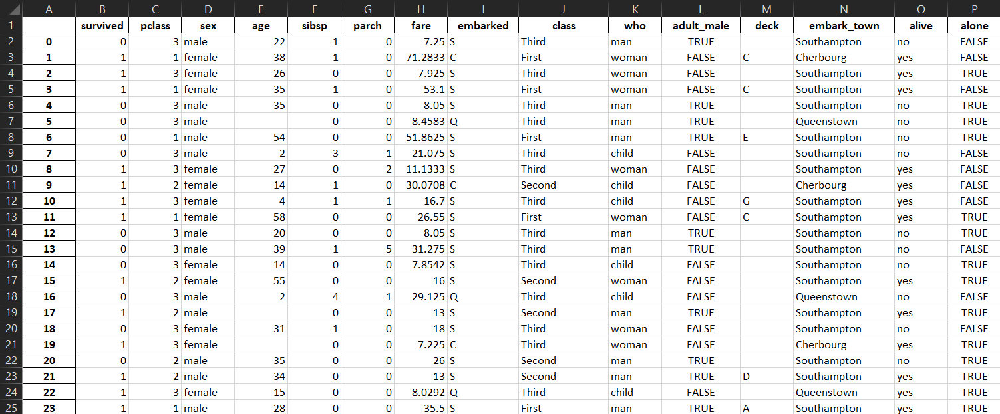
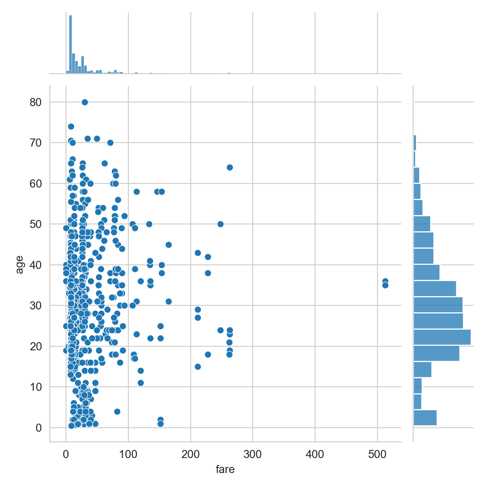
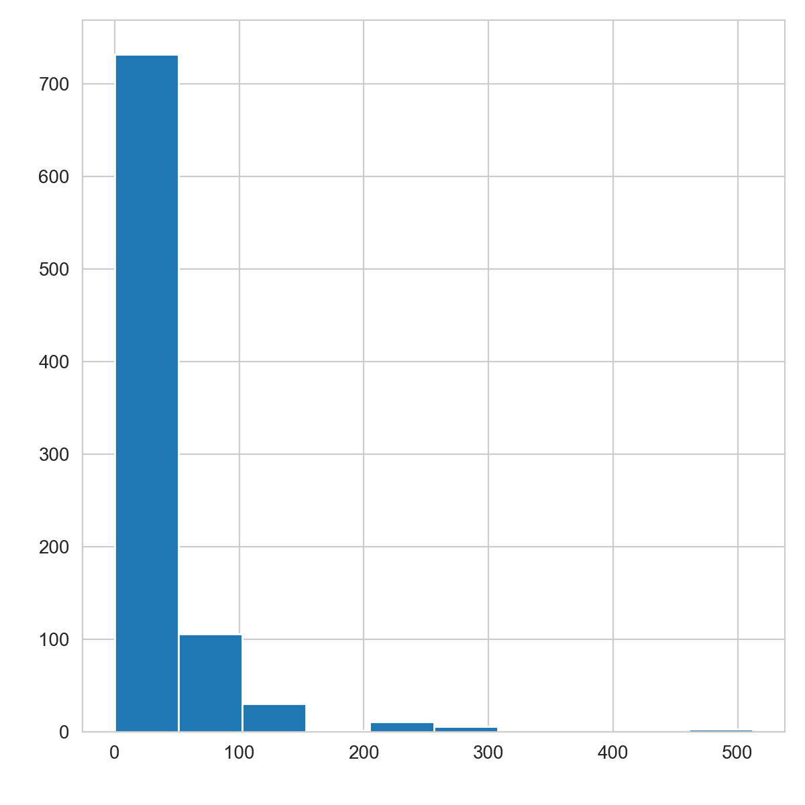
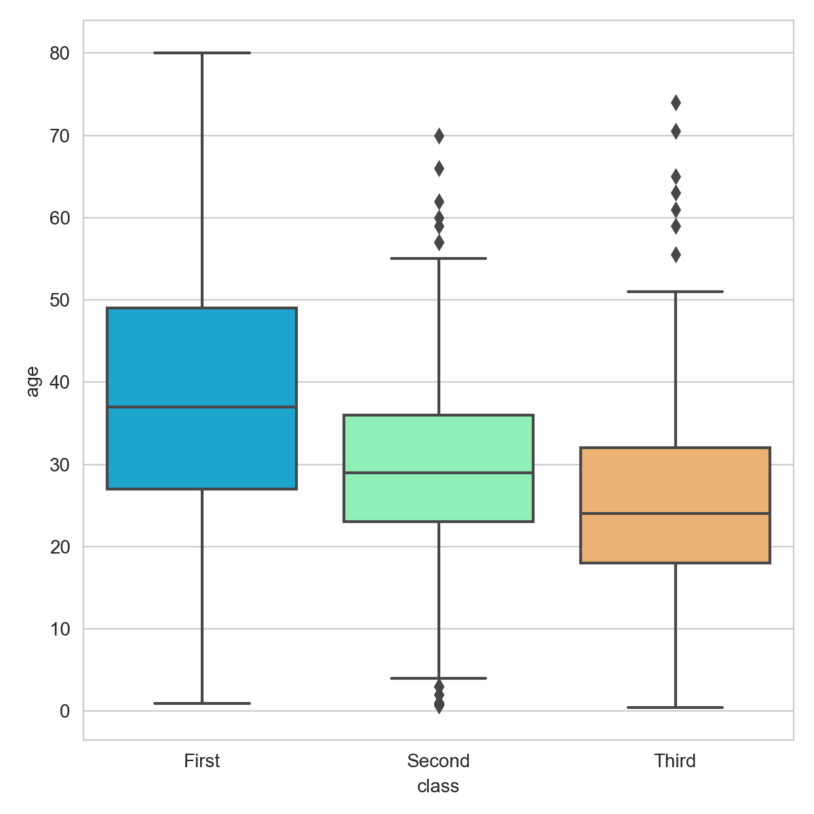
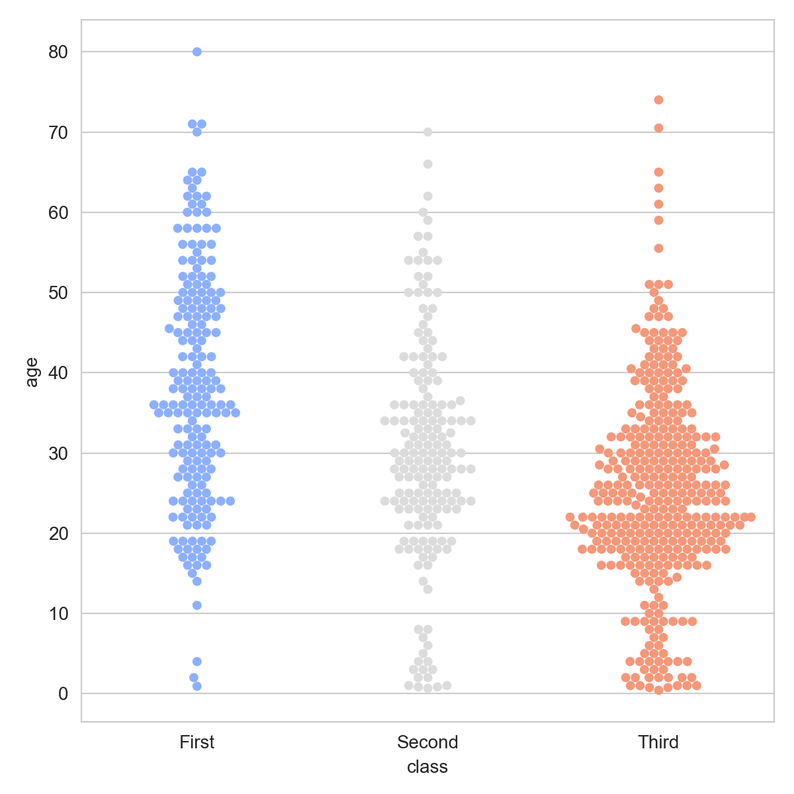
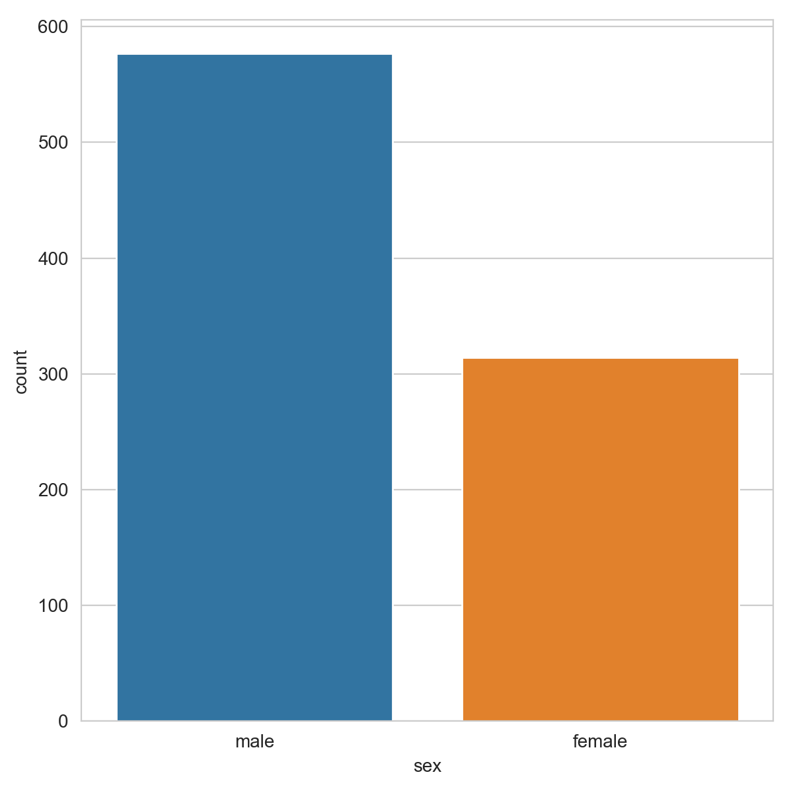
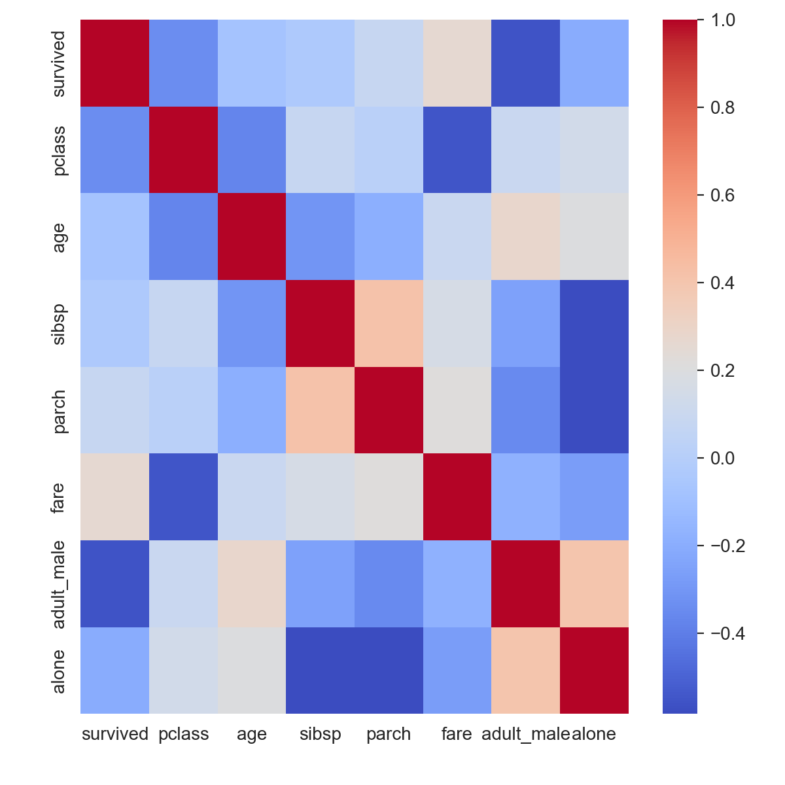
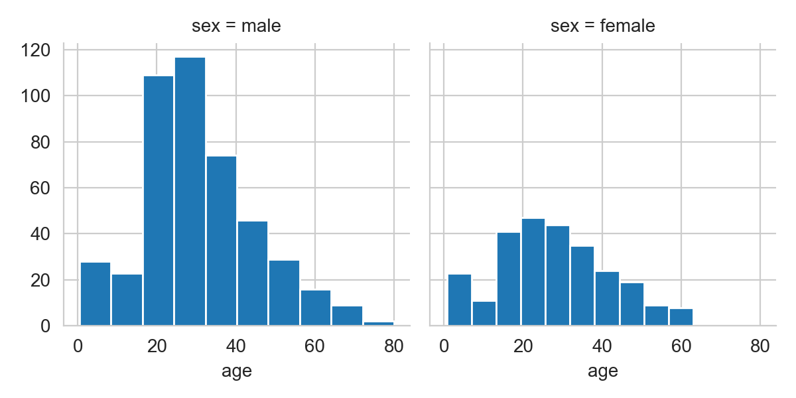

# Titanic Data Visualization

This program shows the power of the matplotlib and seaborn packages in python to visualize the data of titanic survivors. 

Dataset:

## Packages
* [Matplotlib](https://matplotlib.org/)
* [Seaborn](https://seaborn.pydata.org/)

## Graphs

These are the various graphs created by the script.

1. Joint Plot of fare vs age

2. Histogram of fare

3. Boxplot of class vs age

4. Swarm plot of class vs age

5. Count plot of sex

6. Heat Map of titanic dataframe

7. Facet Grid of age for different sex(histogram)

## Built With

* [Pycharm](https://www.jetbrains.com/pycharm/) - IDE used

## Authors

* **Tanush R** - [tanush-r](https://github.com/tanush-r)